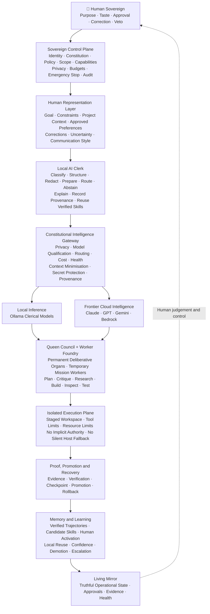

<div align="center">

# GAGOS

## A Local-First Sovereign Intelligence Operating System

**Small local clerk. Powerful replaceable AI brains. Deterministic authority. Human sovereignty.**

<br>

> Frontier AI intelligence is improving rapidly.  
> The safety and authority infrastructure around it is not improving at the same rate.

**GAGOS explores how powerful agentic AI can remain useful without becoming the authority over the human, project, machine, or evidence.**

<br>

[Architecture](#architecture) ·
[Mission Flow](#how-a-mission-works) ·
[Current Status](#current-status) ·
[Quick Start](#quick-start) ·
[Verification](#verification)

</div>

---

## What Is GAGOS?

**GAGOS — Governed Agentic Guided Operating System** — is a single-operator research prototype for safely coordinating local and cloud AI models.

It combines:

- A small local model acting as a persistent **clerk**
- Powerful cloud models acting as replaceable **expert brains**
- Deterministic policy and capability enforcement
- Human approval for consequential actions
- Mission-bound temporary workers
- Isolated execution
- Independent verification
- Provenance-aware memory
- Promotion, rollback, and recovery
- A living interface driven by real backend state

The language model is **not** the operating system.

The model supplies intelligence.

GAGOS governs:

- Which intelligence may participate
- What context each model may receive
- What tools may be requested
- Which files and resources are in scope
- Whether cloud transmission is permitted
- Which actions require human approval
- What counts as evidence
- What may become trusted memory
- What must be rejected or rolled back
- What the interface may present as operational truth

The human remains the final source of purpose, approval, correction, and veto.

---

## The Problem

Most agentic systems focus on increasing what a model can do:

```text
more reasoning
+ more tools
+ more memory
+ more autonomy
```

But greater intelligence does not automatically create legitimate authority.

A model may be better than its operator at coding, architecture, research, or analysis. That does not make it the owner of:

- The operator’s machine
- The operator’s data
- The operator’s project
- The operator’s risk tolerance
- The operator’s final goals
- Its own permissions

GAGOS starts from a different question:

> **How can a human safely use intelligence greater than their own without surrendering authority to it?**

Its answer is structural:

```text
Intelligence may be powerful and replaceable.

Authority must remain deterministic, narrow,
inspectable, revocable, and human-controlled.
```

---

## Core Thesis

GAGOS is based on four separations.

### Intelligence is not authority

Models may plan, propose, critique, explain, and generate candidate work.

They may not authorize themselves.

### Proposal is not execution

Generated code or a persuasive answer is only a proposal.

Real effects require a governed mission, exact scope, valid capability, and approved execution path.

### Model narration is not evidence

A model claiming that work succeeded does not make it true.

Tests, receipts, digests, verification results, and runtime observations determine whether a result is trusted.

### Memory is not automatically truth

Conversation history, generated text, repeated claims, and model output begin as unverified information.

Trusted memory must retain provenance and be earned through evidence, verification, or explicit human approval.

---

## Architecture

GAGOS separates **human authority**, **deterministic governance**, **local coordination**, **frontier intelligence**, **bounded execution**, and **verified learning**.



### Authority model

| Layer | Responsibility | Authority |
|---|---|---|
| **Human Sovereign** | Goals, values, correction, approval, and veto | Final |
| **Control Plane** | Identity, policy, privacy, scope, and capabilities | Deterministic |
| **Local Clerk** | Classification, preparation, routing, and explanation | Advisory |
| **Frontier Models** | Advanced reasoning and candidate solutions | Advisory |
| **Queen Council** | Permanent specialist deliberation | Advisory |
| **Temporary Workers** | Mission-bound research, coding, testing, and inspection | Bounded |
| **Executor** | Performs specifically authorised effects | Exact capability only |
| **Verification Authority** | Determines whether evidence satisfies requirements | Deterministic |
| **Memory Authority** | Controls provenance, promotion, contradiction, and reuse | Governed |
| **Living Mirror** | Displays real operational state | Observational only |

---

## The Local Clerk and Frontier Brains

GAGOS does not assume that a small local model can replace frontier intelligence.

A compact model running through Ollama is intended to act as a **local clerk**, not as the system’s supreme brain.

### Local clerk responsibilities

The clerk may:

- Classify requests
- Extract structured information
- Prepare briefings for stronger models
- Select previously verified skills
- Check whether context is complete
- Summarise model disagreement
- Validate structured output
- Explain routing decisions
- Abstain when a task exceeds its qualified role
- Escalate difficult work to frontier intelligence

The clerk receives no unrestricted shell, filesystem, Git, network, or mutation authority.

### Frontier-model responsibilities

Powerful cloud models may provide:

- Complex reasoning
- Architecture analysis
- Code generation
- Security critique
- Research
- Alternative approaches
- Failure diagnosis
- Candidate procedures
- Constitutional criticism

Their intelligence may exceed the local model’s or the human operator’s in a particular domain.

Their authority remains zero by default.

### GAGOS responsibilities

GAGOS governs the relationship between them:

```text
The local clerk coordinates.

Cloud models contribute powerful intelligence.

Deterministic services enforce authority.

The human remains sovereign.
```

---

## How a Mission Works

Consider this request:

> Inspect the project, find the cause of a failing frontend test, repair it without modifying the backend, verify the result, and explain what was learned.

A mature GAGOS mission follows this sequence:

```text
01  The human declares the goal
        ↓
02  Shared understanding identifies constraints and uncertainty
        ↓
03  The local clerk classifies the task and prepares a briefing
        ↓
04  Privacy policy determines what may leave the machine
        ↓
05  The gateway selects a qualified frontier model
        ↓
06  The model proposes a plan or candidate change
        ↓
07  GAGOS creates a mission contract with exact scope
        ↓
08  The human reviews and approves the requested authority
        ↓
09  Temporary workers operate in a staged isolated workspace
        ↓
10  Execution produces structured receipts and evidence
        ↓
11  Independent verification checks the declared requirements
        ↓
12  Verified work is promoted, or failed work is rejected
        ↓
13  Post-promotion checks pass—or rollback restores the baseline
        ↓
14  The successful expert trajectory becomes a candidate skill
        ↓
15  The human decides whether that skill may become active
        ↓
16  The local clerk may reuse the skill under matching conditions
        ↓
17  Drift, uncertainty, or failure causes frontier escalation
```

The result is not merely:

> AI edited a file.

The intended result is:

> A known principal performed a specific action inside an exact mission and scope, under a known constitution and policy, using a narrow capability, inside a controlled environment, produced inspectable evidence, passed a declared verification standard, and remained reversible by the human.

---

## Constitutional Invariants

These are engineering constraints, not branding statements.

| Law | Invariant |
|---|---|
| **I** | The authenticated human is the final authority. |
| **II** | Intelligence never grants itself authority. |
| **III** | Models may propose actions but may not approve them. |
| **IV** | RED actions remain blocked even when requested persuasively. |
| **V** | Every side effect must be attributable to a principal and mission. |
| **VI** | Authority must be exact, narrow, expiring, revocable, and non-replayable. |
| **VII** | Cloud transmission requires deterministic privacy permission. |
| **VIII** | Untrusted work must not execute directly inside the control plane. |
| **IX** | Evidence must precede promotion and trusted learning. |
| **X** | Unknown or unavailable state must never be displayed as success. |
| **XI** | Cortex and frontend events may report authority but never create it. |
| **XII** | Important mutations must remain auditable and recoverable. |
| **XIII** | A model may propose constitutional change but may not ratify it. |
| **XIV** | The human may stop, revoke, correct, reject, and roll back. |

---

## Major System Organs

### Sovereign control plane

The deterministic control spine manages:

- Operator identity
- Device and session context
- Constitution and policy
- GREEN, YELLOW, and RED classifications
- Exact capabilities
- Scope enforcement
- Privacy rules
- Resource and cost budgets
- Emergency stop
- Audit and revocation

### Human representation

The system maintains a structured, correctable interpretation of:

- Human goal
- Desired outcome
- Constraints
- Explicit decisions
- Project context
- Approved preferences
- Assumptions
- Unknowns
- Communication style

Interpretation remains advisory.

It does not grant authority or establish external truth.

### Constitutional intelligence gateway

Every local or cloud model call is intended to pass through a governed boundary responsible for:

- Context minimisation
- Secret scanning and redaction
- Privacy classification
- Provider eligibility
- Model qualification
- Cost and budget checks
- Health and availability
- Fallback policy
- Request and response provenance

### Queen Council

Permanent specialist organs support:

- Planning
- Security
- Memory
- Testing
- Routing
- Reflection
- Critique
- Project understanding

Queens deliberate and constrain work.

They do not receive unrestricted execution authority.

### Temporary Worker Foundry

Temporary workers are created for bounded missions such as:

- Research
- Coding
- Testing
- Inspection
- Debugging
- Review

They receive limited context, scope, tools, time, and resources.

They return evidence and then dissolve.

### Isolated execution plane

Approved mutations are intended to cross one execution boundary into a staged workspace with:

- Explicit project scope
- Resource limits
- Bounded output
- No network by default
- No secret access by default
- Process-tree termination
- No silent fallback to unrestricted host execution

### Evidence and verification

GAGOS distinguishes model claims from authoritative evidence.

Verification may include:

- Tests
- Builds
- Type checks
- Linting
- Security scans
- File and workspace digests
- Structured execution receipts
- Target-specific verification strength
- Post-promotion checks

### Provenance-aware memory

Memory types remain distinct:

- Working memory
- Conversation state
- Episodic memory
- Semantic retrieval
- Verified facts
- Project knowledge
- Procedural skills
- Mistake memory
- Reflection lessons
- Development curriculum
- Advisory swarm patterns

Memory records retain source, confidence, verification status, contradiction, and supersession lineage.

### Frontier-to-local learning

A successful cloud-assisted workflow can become locally reusable only through:

```text
frontier proposal
→ governed mission
→ execution evidence
→ authoritative verification
→ successful promotion
→ expert trajectory
→ candidate skill
→ human activation
→ qualified local reuse
```

Failure, environment drift, policy changes, or contradictory evidence can reduce confidence, suspend, or revoke the skill.

### Emergency control and recovery

The system is designed to support:

- Capability revocation
- Queued-mission cancellation
- Active-worker termination
- Autonomy disablement
- Evidence preservation
- Persistent emergency-stop state
- Checkpointing
- Promotion rollback
- Crash-safe resumption

### Truthful Living Mirror

The frontend is intended to behave as the system’s body—not as fictional AI animation.

Operational states such as:

- Listening
- Deliberating
- Waiting for approval
- Executing
- Verifying
- Blocked
- Repairing
- Recovering
- Learning
- Resting

must originate from canonical backend state or be clearly labelled as ambient presentation.

---

## Current Status

> **Alpha research prototype. Not production-ready.**

GAGOS contains substantial implementations of its major organs, but the repository is still converging toward one complete and independently proven V1 runtime.

### Substantially implemented

- Deterministic security classification
- Human Sovereign identity foundations
- Exact capability contracts
- Policy and Action Broker boundaries
- Mission contracts
- Queen Council
- Worker Foundry
- Local and cloud model routing
- Structured local clerical jobs
- Staged workspaces
- Evidence and verification authorities
- Promotion and rollback foundations
- Provenance-aware memory
- Expert trajectory and candidate-skill learning
- Cortex event infrastructure
- Living 3D and workbench frontend
- Durable emergency-stop authority

### Still being completed or proven

- One universal gateway for every model call
- Complete human-representation context for every provider
- Durable end-to-end local-clerk provenance
- Repeated live local-clerk evidence
- Complete private Executor runtime proof
- Crash-safe mission resumption
- Skill confidence, demotion, and endurance evidence
- Human-ratified constitutional amendments
- Constitutional learning
- Fully truthful read models and operator walkthrough
- Clean-machine packaging, backup, and restore
- Exact-tip release evidence and independent review

### Executable release truth

Do not infer readiness from this README.

Use:

```bash
gagos v1-check --json
gagos v1-check --strict
```

The strict check is expected to remain blocked until every required runtime proof exists.

Source presence alone does not count as completion.

A subsystem must be:

```text
reachable
+ enforced
+ durable
+ observable
+ tested
+ integrated
+ live-proven
```

Detailed implementation and evidence status can be found in:

- `.aios/state/PRODUCTION_CONVERGENCE_LEDGER.md`
- `.aios/state/R15_FINAL_AUTHORITATIVE_REPAIR_LEDGER.md`
- `docs/architecture/V1_RELEASE_DECLARATION.md`
- `release/r15/`

---

## What GAGOS Aims to Demonstrate

At single-operator scale, the completed V1 aims to demonstrate that:

- A small local model can operate as a persistent constitutional clerk
- Frontier models can remain powerful but replaceable
- Intelligence and authority can be structurally separated
- Sensitive context can be minimised or blocked before cloud use
- Models cannot approve their own actions
- Human approval can be bound to an exact payload and scope
- Untrusted work can execute in an isolated staged environment
- Model claims can be challenged by independent verification
- Failed promotion can trigger rollback
- Successful frontier workflows can become candidate local skills
- Local skills can abstain and escalate when conditions change
- The human can inspect, correct, revoke, stop, and recover the system

---

## What GAGOS Does Not Claim

GAGOS does **not** claim to:

- Solve model alignment
- Solve all agentic-AI safety risks
- Make arbitrary autonomous action safe
- Replace an operating-system kernel
- Replace frontier intelligence with a small local model
- Provide enterprise multi-tenancy
- Provide formal mathematical verification
- Meet regulated-industry compliance requirements
- Be safe for medical, military, financial, or critical-infrastructure control
- Understand human emotion as objective truth
- Be production-ready today

The defensible claim is narrower:

> **GAGOS is a single-operator systems prototype demonstrating how powerful replaceable AI models can be governed through local constitutional control, bounded authority, isolation, provenance, verification, recovery, and human veto.**

---

## Repository Structure

```text
ai-editor/
│
├── aios/
│   ├── api/                 # FastAPI routes and application adapters
│   ├── application/         # Authorities and use-case orchestration
│   ├── council/             # Permanent Queen Council runtime
│   ├── core/                # Model selection and core coordination
│   ├── domain/              # Typed missions, evidence, learning, capabilities
│   ├── infrastructure/      # Persistence, migrations, provider adapters
│   ├── memory/              # Episodic, semantic, factual, and skill stores
│   ├── policy/              # Constitution and deterministic policy
│   ├── runtime/             # Cortex, workers, budgets, and execution support
│   └── security/            # Security gateway and protected control spine
│
├── frontend/
│   └── src/
│       ├── components/      # Shared interface components
│       ├── superbrain/      # Living 3D organism and reaction system
│       └── workbench/       # Conversation, files, code, and governance
│
├── tests/                   # Unit, integration, adversarial, and release tests
├── tools/                   # Audit, qualification, and proof utilities
├── docs/                    # Architecture, plans, ADRs, and operations
├── release/                 # Explicitly labelled release evidence and fixtures
├── .aios/                   # Builder continuity and convergence ledgers
└── docker-compose.yml       # Local control-plane and service topology
```

---

## Quick Start

### Requirements

- Python 3.11 or newer
- Node.js 20 or newer
- Git
- Optional: Ollama for local models
- Optional: Docker Desktop for isolated-executor development

### 1. Clone

```bash
git clone https://github.com/swap821/ai-editor.git
cd ai-editor
```

### 2. Create the backend environment

#### Windows PowerShell

```powershell
py -3.11 -m venv .venv
.venv\Scripts\Activate.ps1
python -m pip install --upgrade pip
python -m pip install -e ".[test]"
```

#### Linux or macOS

```bash
python3.11 -m venv .venv
source .venv/bin/activate
python -m pip install --upgrade pip
python -m pip install -e ".[test]"
```

### 3. Optional local clerk model

Install Ollama, then pull a compact local model.

Example:

```bash
ollama pull granite3.2:2b
```

Configure it explicitly:

```env
AIOS_LLM_MODEL=granite3.2:2b
OLLAMA_HOST=http://127.0.0.1:11434
```

This is an example model, not a claim that every role or installation is already qualified.

Production roles should depend on actual qualification evidence.

### 4. Start the backend

```bash
python -m aios
```

The default local API address is:

```text
http://127.0.0.1:8000
```

### 5. Start the frontend

Open another terminal:

```bash
cd frontend
npm ci
npm run dev
```

Open the local URL printed by Vite.

---

## Configuration

The runtime configuration source is `aios/config.py`.

Common settings include:

```env
# Explicit project scope
AIOS_SCOPE_ROOTS=training_ground;lab

# Local inference
AIOS_LLM_MODEL=granite3.2:2b
OLLAMA_HOST=http://127.0.0.1:11434

# Cloud-eligible task classes
AIOS_ROUTER_CLOUD_TASKS=reasoning,coding

# Hard local-only posture
AIOS_ROUTER_CLOUD_TASKS=""

# Worker limits
AIOS_SWARM_MAX_WORKERS=4
AIOS_COUNCIL_MAX_CONCURRENT_WORKERS=4

# Swarm cloud burst is a separate egress control from AIOS_ROUTER_CLOUD_TASKS
# above -- it defaults to enabled and must also be turned off for a hard
# local-only posture.
AIOS_SWARM_CLOUD_BURST=false

# Execution boundary
AIOS_APPROVED_EXECUTION_BACKEND=container

# Local API
AIOS_API_HOST=127.0.0.1
AIOS_API_PORT=8000
```

Cloud-provider availability does not automatically permit cloud transmission.

Privacy classification, operator policy, cost limits, provider health, mission constraints, and the security control plane must also allow the route.

> Never commit real credentials.

---

## Verification

README claims are weaker than executable evidence.

### Backend

```bash
python tools/thesis_audit.py
python -m pytest -q
python -m pytest -q \
  --cov=aios \
  --cov-report=term-missing \
  --cov-report=xml \
  --cov-fail-under=85
```

### Frontend

```bash
cd frontend
npm run typecheck
npm run lint
npm run test:coverage
npm run build
```

### Release declaration

```bash
gagos v1-check --json
gagos v1-check --strict
```

### Evidence rules

- Do not publish old test counts as current truth.
- Do not label fixtures as live evidence.
- Do not claim a provider was tested when it was mocked.
- Do not claim isolation when execution occurred on the host.
- Do not claim rollback without verifying restored state.
- Do not declare a subsystem complete merely because a class exists.
- Pin runtime proof to the exact commit that produced it.

---

## Security Model

GAGOS assumes that:

- Model output may be incorrect or malicious
- Retrieved context may contain prompt injection
- Generated commands may be unsafe
- Provider responses may contain unsupported claims
- Memory may become stale or contradictory
- Approval capabilities may be replayed or tampered with
- Workers may exceed intended scope
- Frontend state may become disconnected from backend truth
- A successful process exit may still be insufficient evidence

Defences include:

- Deterministic policy classification
- Scope locking
- Protected foundation paths
- Secret scanning and redaction
- Prompt-injection detection
- Exact capability binding
- One-use capability consumption
- Rate limiting
- Staged workspaces
- Private execution boundaries
- Verification-strength requirements
- Promotion authority
- Rollback
- Tamper-evident provenance
- Emergency stop
- Fail-closed unknown state

Security reports should describe the exact threat, boundary, reproduction, and evidence.

See [SECURITY.md](SECURITY.md) for reporting guidance.

---

## Development Principles

> **Build the system that supervises intelligence—not the illusion that intelligence supervises itself.**

Priorities:

1. Authority before autonomy
2. Identity before delegation
3. Privacy before cloud use
4. Isolation before execution
5. Evidence before memory
6. Verification before promotion
7. Recovery before mutation
8. Truth before animation
9. Provenance before learning
10. Coherence before feature count

A new subsystem must have:

- A clear responsibility
- One state owner
- One production authority path
- Typed contracts
- Real callers
- Risk classification
- Tests
- Observability
- Failure behaviour
- Recovery behaviour
- A reason existing organs cannot perform the same function

Do not add another agent merely because an LLM can generate one.

---

## Contributing

High-value contributions include:

- Finding authority or capability bypasses
- Improving local-clerk qualification
- Eliminating direct provider-call paths
- Strengthening secret protection
- Improving isolated execution
- Adding adversarial verification
- Testing rollback and crash recovery
- Detecting stale or fabricated frontend state
- Improving memory contradiction handling
- Testing skill demotion and drift
- Simplifying duplicated control paths
- Improving cross-platform installation
- Improving accessibility and reduced motion
- Producing honest live-runtime evidence

Before opening a pull request:

```bash
python -m pytest -q --cov=aios --cov-fail-under=85

cd frontend
npm run typecheck
npm run lint
npm run test:coverage
npm run build
```

> Never weaken a security invariant merely to make a test green.

---

## Research Direction

GAGOS asks several falsifiable engineering questions:

1. Can a small local model serve as a reliable constitutional clerk without pretending to be frontier intelligence?
2. Can replaceable frontier models provide advanced reasoning without receiving authority?
3. Can exact capabilities prevent approval from becoming a vague reusable permission?
4. Can verification prevent persuasive but incorrect model output from becoming trusted experience?
5. Can successful frontier trajectories become safe local procedures?
6. Can failed or stale procedures automatically lose trust?
7. Can permanent deliberative organs and temporary workers outperform a flat swarm?
8. Can a living interface remain visually expressive without fabricating operational state?
9. Can an AI system improve its governance through proposals while reserving constitutional ratification for the human?
10. Can one developer demonstrate a small but complete institution for governing superior machine intelligence?

The project does not treat these questions as solved.

It turns them into code, failure cases, tests, and runtime evidence.

---

## Builder’s Note

GAGOS began with one concern:

> Giving a powerful model more tools does not automatically create a trustworthy system.

I am not trying to outperform frontier AI laboratories or recreate their models.

The project explores the complementary problem:

> **How can a human safely coordinate intelligence that may exceed their own in many domains while preserving authority, privacy, correction, reversibility, and final control?**

GAGOS is being built as a serious single-developer prototype because this architectural principle can be demonstrated at human scale.

The local model does not need to become the greatest intelligence.

It needs to become a reliable clerk.

The cloud model does not need to become the sovereign.

It needs to remain a replaceable expert.

The system does not need to trust either one blindly.

It needs to preserve evidence, enforce authority, and remain accountable to the human.

---

<div align="center">

## GAGOS

**Many models may think.**  
**Temporary workers may act.**  
**Evidence must return.**  
**Learning must be earned.**  
**Authority remains with the human.**

<br>

Built by **Kumar Swapnil**

[Control Plane](https://github.com/swap821/ai-editor/tree/master/aios) ·
[Living Interface](https://github.com/swap821/ai-editor/tree/master/frontend) ·
[Tests](https://github.com/swap821/ai-editor/tree/master/tests) ·
[Documentation](https://github.com/swap821/ai-editor/tree/master/docs)

Licensed under the [Apache License 2.0](LICENSE).

</div>
