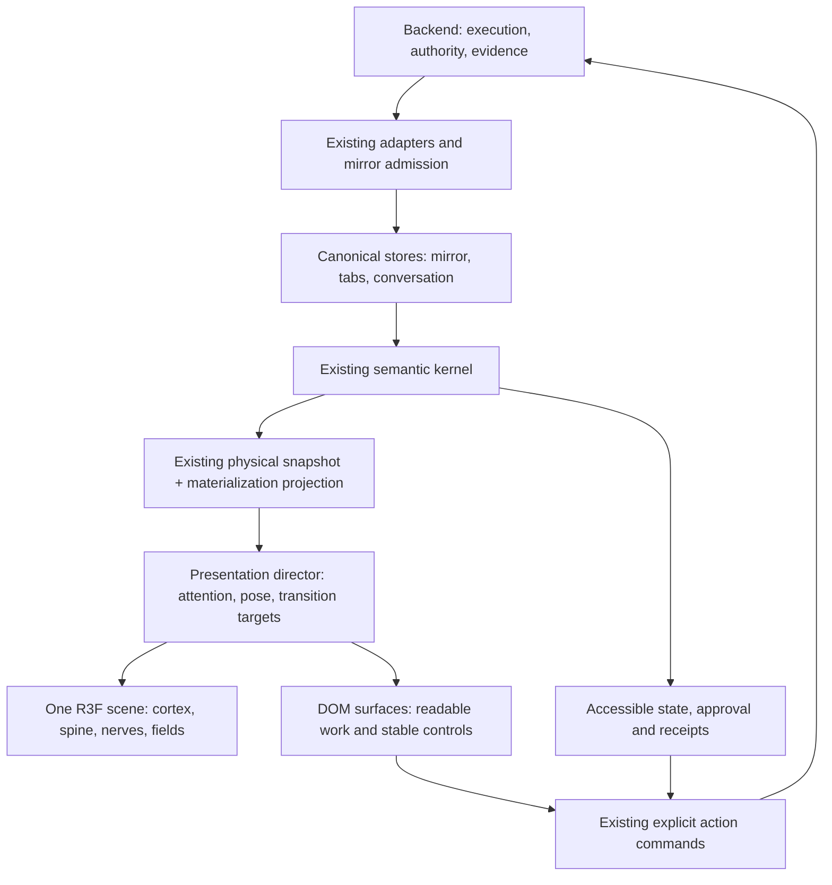

# GAGOS living-being frontend: production blueprint

Date: 2026-09-24. Status: researched proposal, ready for staged implementation; not a production-readiness certificate.

Product baseline: `4782cfa356ad23015bf090f7a671b74967a373f8`, current `origin/master` when inspected, containing PRs #363, #364 and #362. Planning branch: `codex/living-being-blueprint`. No application or backend implementation changed for this proposal.

Operator clarification: **the official `frontend/` is the product; the external GAG demo repository supplies visual reference. Desktop and mobile are equally important.** The north star is `GAG demo/reference/demoplan.png`: one point-field organism, cortex and spine continuous, attention visible in its posture, work surfaces growing along nerves, results returning into the body.

Start execution with [LUNA_EXECUTION_PACK_2026-09-24.md](LUNA_EXECUTION_PACK_2026-09-24.md). The current proposal extends the existing [physical embodiment RFC](GAGOS_PHYSICAL_EMBODIMENT_RFC.md) and [Living Mirror contract](LIVING_MIRROR_RENOVATION.md). It does not restart either implementation.

## 1. The honest assessment

The vision is achievable as a distinctive, useful real-time interface. No plan can guarantee that everyone will perceive it as alive, or guarantee performance on unspecified hardware. We can make those ambitions testable and reduce the largest risks early.

The central problem is **coherence**. A convincing being needs one recognizable body, one readable direction of attention, and consistent reactions to cause and consequence. A beautiful brain beside ordinary application panels can be an excellent visualizer while still missing this vision. More particles, more panels, more events, or more code do not repair that gap by themselves.

There is no justified requirement for 80,000 additional lines. At the inspected baseline, tracked TS/TSX/JS/JSX/CSS under `frontend/src` already contains 250 non-test files with 44,681 nonblank lines, plus 175 test files with 15,110 nonblank lines. This count includes comments and excludes blank lines, assets, generated build output and dependencies; it is not a complexity score. The right outcome may involve deleting duplicated code while adding substantial behavior.

Nor should this frontend plan assume the backend is universally production-ready. Existing evidence proves useful slices of the animal/cage boundary, but the recorded experimental swarm request returns `strategy_unavailable`, and a recorded verifier pass required an explicitly declared development runner. Those are integration dependencies, not reasons to invent convincing activity.

Treat the desired sense of life as a design effect. The product must remain candid about actual activity, memory, connectivity, permission, failure and uncertainty. Ambient breath must never claim that a model is reasoning or that memory was learned.

## 2. What the inspection actually establishes

### Reuse and gaps

| Area | Existing evidence / code | Required next step |
| --- | --- | --- |
| Product composition | `SuperbrainApp.jsx` composes one scene, `GagosChrome` and `LivingWorkspaceShell` | Unite the visual composition without breaking the DOM control plane |
| Semantic truth | `semanticKernel.ts`, `presentationFromStores.ts`, `useBeingPresentation.ts` | Keep this canonical projection; audit every renderer consumer |
| Physical projection | `physicalSnapshot.ts`, `physicalMaterialization.ts`, `SuperbrainReactiveEffects.jsx` | Drive the actual substrate and workspace choreography, beyond added cue geometry |
| Core body | `CortexEngine.tsx`, `BrainPointField.tsx`, `bodyPosture.ts`, `turnMetabolism.ts` | Reconcile its older lifecycle/conversation control with the canonical semantic projection |
| Work surfaces | `tabStore.ts`, `anatomicalConductor.ts`, `MaterializedTab.tsx`, `useWorkMaterialization.js` | Preserve identity and content while making birth/focus/retraction one continuous spatial event |
| Approval and outcomes | Guided approval, emergency controls, `experience/receipts.ts`, `ReceiptCard.tsx` | Preserve immediate truthful controls through every motion and responsive state |
| Validation tools | 21-fixture physical gallery; bounded frontend metrics; recorded idle and worker-fixture soaks | Extend these existing tools to measure the whole renderer and real devices |
| Live integration | Recorded authenticated chat, approval hold, approved write, declared development verification | Add correlated browser evidence for complete journeys; resolve supported worker route with its backend owner |
| Source ownership | Product mirror hashes in `superbrain-source.json`; port guard requires ignored lab source | Make a clean checkout reproducible before changing managed anatomy |
| Older additive modules | #362 leaves `beingPresentation.ts`, `beingScenePresentation.ts`, `BeingStatus`, `GuidedTaskStory`, `OutcomeReceipt` alongside newer modules | Confirm imports and feature parity, then consolidate; do not wire a second semantic kernel |

The older scene still schedules timed bursts/thought waves and idle cascades in `CortexEngine`. These are source-observed presentation mechanisms, not evidence of background inference. Distinguish ambient life from task activity in the new motion contract.

`PhysicalSnapshot.branches` currently projects bounded states into ordinal slots. The next worker implementation needs stable admitted worker identity internally and a stable seat mapping across insertion, removal and replay; array order is insufficient for persistent anatomical identity. Raw identifiers remain out of Guided copy.

Quality ownership also needs cleanup: `QualityTierProvider` contains earlier descriptions of automatic demotion, while its current returned structural and performance tiers both equal the selected base tier. Do not implement from comments alone.

### Fresh visual inspection

A production preview of the already-built PR #362 worktree was inspected at `127.0.0.1:5190`. Its tracked frontend has no diff against the inspected `master`. This was a visual inspection of the existing build, not a fresh test run or an authenticated backend journey.

At the desktop capture, the brain/spine is visibly present and distinctive. Conversation occupies the left, mode controls sit above, status controls sit below, and Emergency Stop is separate. My visual judgment: these still read as adjacent interface pieces. Bright internal forms and broad bloom soften the point-field detail compared with the supplied poster. The starter content is in a constrained scrolling region. These are design observations, not measured GPU diagnoses.

A 390×844 CSS viewport check reported document width 390 and a 44px-high request input. The canvas layout was approximately 390.4×354.2 CSS pixels. The narrow screenshot was scaled by the capture surface and is not credited as detailed mobile visual acceptance. No physical phone, mobile keyboard, touch, thermal behavior, screen reader or field performance was tested in this planning session.

### Existing evidence must retain its limits

The prior branch verification reported 175 files / 953 tests passing. Existing records also include a persistent idle soak and a 30-minute worker-gallery soak. Credit those exact tests and environments. Do not translate them into a percentage of visual completion or certification for all phones.

The current metrics read `renderer.info` from a frame callback. With post-processing, a reported single render call needs validation against the complete pass chain: Three.js resets statistics per render by default. This is a measurement concern requiring an instrumented check, not proof that the recorded samples were fabricated. [Three.js renderer statistics](https://threejs.org/docs/pages/WebGLRenderer.html).

## 3. Art direction: what “2030” means here

The visual proposition is **luminous neural matter operating in deep black space**. Preserve the supplied palette and protected textures. The being, its nerves and its work should share one visual grammar. Sophistication comes from precision, hierarchy, materials, timing and restraint.

Use the existing canonical cyan `#7bf5fb`, purple `#b06eff`, green `#54f0a0`, and orange `#ff7e40` anchors through the project's tokens/materials, with approved neutral text and backgrounds. Do not recolor the organism to make a benchmark easier. Semantic states require shape, posture, readable labels and patterns as well as color.

Specific direction:

- Preserve a recognizable cortical silhouette, negative spaces and a clearly attached spinal axis. Internal activity should follow visible structure instead of becoming disconnected bright blobs.
- Give point matter three readable scales: coarse silhouette, mid-scale fiber/region structure, and fine particles. At reduced density retain the first two; uniform thinning that destroys the silhouette is unacceptable.
- Keep the spatial background quieter and darker than the organism. A sense of travel can come from distant motion; the camera and reading plane need not drift continually.
- Keep bloom local to high-energy edges and paths. Judge the field first without bloom, then add it. Bloom cannot substitute for structure.
- Make work surfaces look related to the body through their origin, connection, edge treatment and transition. Their text remains crisp, stable and selectable.
- Retain the existing typography unless actual legibility tests justify changing it. Use ordinary sentence case for product controls, restrained technical typography in Expert, and no tiny glowing paragraphs.
- Limit simultaneous focal events. During typing, permission review, error recovery and reading, the body quiets and points toward the relevant surface.
- Keep sound optional, muted by default until a deliberate opt-in. No essential meaning depends on sound or voice.

The poster's seven panels are a storyboard, not seven screens. Its tiny tilted windows are suitable for demonstrating relationships; the active production workspace must become a comfortable reading/editing plane. Its illustrative model labels, latency numbers and status legend are not operational data.

Approve a short art-direction sheet with three keyframes—resting, working, awaiting permission—at desktop and mobile compositions before broad shader work. Approve a moving slice next; a static image cannot certify aliveness.

## 4. The seven-phase behavior contract

These are overlapping product postures, not a forced linear wizard. A user can interrupt, revisit, switch work or lose connectivity at any point.

| Reference phase | Intended behavior | Required invariant |
| --- | --- | --- |
| Arrival | Field assembles into the familiar body; first input becomes available promptly | Optional/shortened on return; assets or animation never gate control access |
| Rest / first contact | Calm low-amplitude breath; invitation anchored near the intake/spine | Idle motion does not represent backend work; typing is always discoverable |
| Awakening / conversation | Attention turns toward input; measured speech/response changes local energy | Local input acknowledgment is immediate; reasoning/streaming claims require admitted evidence |
| Materialization | A nerve reaches from a stable seat; a surface opens at its endpoint | Content and surface identity survive motion interruption, resize and reconnect |
| Orchestration | One attended surface comes forward; others stay related to named tasks/seats | Stable identities; bounded visible branches; all work remains reachable |
| Working / showing work | The attended surface updates; directional activity connects source and destination | No fake progress, invented worker or terminal success from an animation timer |
| Reabsorption | Connection retracts and surface settles into a recoverable history/receipt | Do not remove content the user is reading or editing; visual disappearance is not data deletion |

Overlay states have priority across all seven: stop, permission, stale/unavailable, failure, verification, then ordinary work. Preserve distinctions when they coexist: for example, show a pending permission request with stale connection information, while the server remains responsible for validating any attempted decision.

## 5. One presentation contract, several consumers

Keep existing backend authority and transport admission. Extend current seams rather than introducing a new global state bus.

“Presentation director” is a responsibility, not a mandated new framework or giant class. It resolves competing visual demands, consumes immutable semantic targets, and exposes mutable render targets through refs. It cannot authorize actions, assign backend work, manufacture memory, or decide verification. Existing buses may remain transport adapters during migration; they must not independently redefine the same posture.

The target contract needs the following concepts, extending existing types only where absent:

- connection/freshness and the current session/turn boundary;
- backend facts with provenance, entity identity and ordering/cursor where supplied;
- task activity, approval state, verification and recovery as separate dimensions;
- stable task/surface/worker identity and focused anatomical seat;
- interaction attention from pointer, keyboard, touch and active reading/editing;
- render capability and user motion/quality preference;
- current visual pose, target pose, interruption policy and presentation timestamp.

Use three time domains deliberately: authoritative event ordering, measured local arrival time, and visual interpolation time. Never subtract unsynchronized server/client clocks to claim network latency. Replay must restore state without replaying old “success” celebrations or duplicating workers. A missing terminal event remains incomplete. A new turn cannot inherit a previous turn's verification or privacy claim.

Body status updates and critical DOM messages happen as soon as evidence is admitted. Easing follows; it never holds up Stop, Deny, failure information, result access or keyboard focus.

## 6. What should make the being feel alive

My design hypothesis is that **contingency, attention and continuity** will contribute more than decorative complexity. Validate this with users rather than treating it as a universal law.

1. **Contingency:** the body acknowledges what the user just did, in the appropriate place. Typing, selecting a result and stopping work produce distinct reactions.
2. **Attention:** orientation, local convergence and connection emphasis agree about the same target. A competing idle orbit must not pull the body away during a decision.
3. **Continuity:** work grows from a known origin, retains identity, and returns through a related path. Repeatedly rebuilding a surface at a new random position breaks that continuity.
4. **Secondary motion:** a restrained delayed response in fibers/spine follows the main movement. It should suggest a material rather than independent sine waves everywhere.
5. **Memory of interaction:** a reopened artifact returns to its stable identity and focus context. Durable “learning” marks require actual recorded promotion.
6. **Meaningful restraint:** the body holds at a permission boundary, becomes uncertain with stale information, and settles differently for verified and unverified work.

Staging, anticipation, timing and follow-through are established animation principles; their application here is an interaction-design proposal, not evidence of consciousness. [Original 3D animation paper](https://www.cs.cmu.edu/afs/cs/academic/class/15462-f13/www/lec_slides/Lesseter.pdf).

Initial tuning ranges, to test rather than hard-code as universal rules:

| Motion | Starting range | Interaction rule |
| --- | --- | --- |
| Press/input acknowledgment | next paint; target under 100ms | Never wait for the model |
| Attention redirect | 120–220ms | Retarget from current pose; avoid queued movements |
| Ordinary surface focus | 160–260ms | Content actionable immediately; minimal travel for keyboard use |
| First surface formation | 250–450ms | Nerve, rim and readable content share one timeline |
| Reabsorption | 200–400ms | Only on safe dismissal/settlement; receipt persists |
| Optional first arrival | roughly 0.8–1.5s after assets are available | Controls appear independently; skip or shorten subsequent visits |
| Ambient breath | slow, small, non-semantic | Pausable; absent in reduced motion |

The motion-design skill informs the fast frequent controls, interruption behavior and restrained secondary effects. The organism's expressive movement is intentional; generic UI motion limits are not applied blindly to a character performance.

## 7. Spatial workspaces that are useful

Keep one persistent DOM instance for each active surface where practical. Moving between overview and focused presentation must preserve editor selection, composition input, scroll, unsaved text and focus. Avoid remounting heavy editors to achieve a visual transition.

Define three presentation depths: attended, available, and resting. Only the attended surface needs full readability and interaction. Others can be compact identity/status representations, with a plain task switcher as an equivalent route. Start with one primary and up to two secondary desktop representations; visible counts are limits, not quotas.

A shared anchor solver maps body-local seat positions into camera/world coordinates and then screen coordinates. It includes safe areas for input, Stop, notices and focused work. It must avoid occlusion, overlapping controls and unstable repositioning. Touch/focus targets use stable screen bounds while decorative geometry can move behind them.

When content comes forward, reduce perspective enough for reading. For long documents, code, tables and receipts use a stable DOM work plane with an anatomical connection still visible. Do not turn editors into WebGL textures, duplicate every editor in both DOM and 3D, or require precise raycasting to press critical buttons.

Reabsorption is explicit dismissal or a safe lifecycle settlement—not “erase after N seconds.” Unreviewed errors, permission requests and unsaved artifacts stay reachable. A user examining a result can keep it open even when the backend task ends.

## 8. Desktop and mobile are first-class compositions

Equal capability does not imply equal particle count or identical placement.

| Concern | Desktop | Mobile |
| --- | --- | --- |
| Rest | Body has room and clear negative space; intake near its base | Compact recognizable body; one obvious thumb-reachable intake |
| Active work | Body shifts aside; stable readable work plane occupies the main area | One full-width focused work sheet; body remains in a compact presence region |
| Multiple tasks | Spine/seat overview plus switcher | Task switcher/list with the same identities and state; no tiny orbiting windows |
| Permission | Stable decision plane, body holds | Stable full-width decision sheet with visible safe actions and Stop access |
| Keyboard | Focus order and shortcuts do not depend on camera position | Software keyboard and browser bars cannot cover input, actions or current decision |
| Inspection | Progressive Expert detail | Same information through progressive sections; no desktop-only authority |
| Fallback | Complete operational DOM | Complete operational DOM, including on unsupported or memory-constrained devices |

Use responsive layout derived from available space and content, plus explicit safe-area insets. Handle visual viewport changes, keyboard opening, landscape and text enlargement. `dvh` alone is not a complete mobile keyboard solution. The VirtualKeyboard API has limited availability; use it only as an enhancement, with tested conventional/VisualViewport behavior. [MDN viewport concepts](https://developer.mozilla.org/en-US/docs/Web/CSS/Guides/CSSOM_view/Viewport_concepts), [VirtualKeyboard API](https://developer.mozilla.org/en-US/docs/Web/API/VirtualKeyboard_API).

Never make hover necessary. Swipes may be shortcuts, with visible button equivalents. Disable scene orbit/drag while interacting with text or controls. Preserve native browser zoom and native scrolling in work content.

**Mobile connectivity is a product dependency.** A phone's localhost is the phone, not the desktop running the backend. The current frontend already supports a production same-origin gateway through `config.js`/Vite. Validate a supported authenticated HTTPS deployment or companion connection through that existing boundary before claiming mobile end-to-end parity. Do not solve this by embedding API tokens or casually exposing the local API to a network. Offline/unpaired mobile must explain what is available and retain safe local drafts under the existing privacy policy; it must not queue privileged approvals for later execution.

Voice needs its own capability matrix. Inspect both actual gateway headers and browser permissions: the inspected Vite policy currently includes `microphone=()`. A missing voice capability must never obstruct typing, and a visual waveform must represent admitted input/playback rather than an invented recording.

## 9. Rendering strategy and technology decisions

Keep React, TypeScript, React Three Fiber, Three.js and the current motion stack for the first release. One canvas, one approved post-processing chain, one palette/material contract. A framework rewrite would add uncertainty without proving the desired experience.

### Body and nerve implementation

- Extend the existing point-field body and fused spine. Author stable seeded sample positions with region/anchor metadata; avoid regenerating random anatomy during normal renders.
- Express posture through a bounded set of uniforms and local deformation/convergence. Structural identity should remain stable across transitions and tiers.
- Use one geometric path definition for the visible nerve, its travelling cue and the screen anchor. Disagreement between three independently computed paths is a common source of visual detachment.
- Start with analytic curves for nerves and bounded shader movement, not general soft-body/fluid simulation. Add simulation only when a measured visual need justifies it.
- Instance repeated branch/pulse geometry; reuse typed buffers and materials. Maintain a deterministic pool/seat allocator, lifecycle expiry and disposal ownership.
- Keep transient effects bounded. Aggregate additional workers into a truthful count/overview when the visible budget is exhausted; never silently imply that omitted workers do not exist.

React handles component lifecycles and lower-frequency semantic changes; render callbacks mutate refs, transforms and uniforms using elapsed time. Avoid per-frame React state updates and recurring object allocation in hot loops. The official R3F guidance supports this division. [R3F performance pitfalls](https://github.com/pmndrs/react-three-fiber/blob/master/docs/advanced/pitfalls.mdx).

### WebGPU is an optional measured experiment

Do not make WebGPU migration the prerequisite for looking futuristic. Three.js documents a WebGL2 fallback, but existing custom ShaderMaterial/onBeforeCompile material code and the current composer require migration to the newer material/post-processing approach. That is not a renderer toggle. First establish the visual slice and profile the current renderer; accept a later spike only if representative hardware shows a worthwhile benefit with matching appearance and fallback behavior. [Three.js migration guidance](https://threejs.org/manual/pages/webgpurenderer).

Likewise, do not introduce an ECS, a physics engine, OffscreenCanvas, a worker renderer or an animation framework merely because the scene is complex. Use a worker for expensive deterministic preprocessing if profiling identifies main-thread stalls; preserve simple ownership and fallback first.

## 10. Performance contract

Performance is a release requirement from the first slice. The following are **proposed acceptance targets**, not measurements already achieved. Lock exact devices and supported browsers during P0; revise budgets only with recorded evidence and operator-visible tradeoffs.

| Measurement | Proposed target and scope |
| --- | --- |
| DOM readiness | Request/Stop/fallback usable independently of 3D load; local feedback under 100ms in the selected test profile |
| Smooth standard tier | Target 60fps; foreground p95 frame interval ≤20ms after warmup on agreed desktop and mainstream phones |
| Economy tier | Sustained approximately 30fps, p95 interval ≤35ms on agreed constrained devices; DOM controls still meet responsiveness targets |
| Critical response | Stop/permission/failure text and local feedback next available paint; backend confirmation separately measured |
| Web Vitals | LCP ≤2.5s, INP ≤200ms, CLS ≤0.1 at p75, split by desktop/mobile where field samples exist |
| Resources | Bounded pools; no sustained growth in post-settle geometry/texture/listener counts over 100 workspace cycles and a 30-minute active soak |
| Cold start | Record initial compressed bytes and parse/compile costs; editor workers and specialist panels stay out of the initial interaction path |
| Mobile endurance | Repeat the actual work journey for 20–30 minutes on physical devices; record frame and interaction degradation, orientation and background/resume recovery |

The Web Vitals thresholds come from [web.dev](https://web.dev/articles/vitals). They do not measure when a WebGL being is visually ready, so retain separate input-ready and first-useful-3D-frame metrics. A lab p75 over repeated local runs is not field p75.

Instrumentation must report device/browser/OS, viewport, DPR, tier, commit, build mode, warmup, sample window, foreground state and scenario. Distinguish RAF pacing from CPU frame cost, GPU time, and end-to-end input latency. Use asynchronous GPU timing only where available and reject disjoint/invalid samples. Measure all render passes; missing counters are unavailable, never zero-cost proof. Object counts are not VRAM bytes.

Use before/after recordings and distributions, not average FPS alone. The 16.67ms budget at 60Hz includes the browser's work too; the application cannot spend all of it on the scene. Test while a local model is working, since the product may share GPU and memory resources with it.

Adapt optional detail using measured load and hysteresis: reduce expensive post-processing and distant decorative work, adjust render resolution, then use a silhouette-preserving lower density. Keep palette, protected textures, meaning, critical controls and readable DOM unchanged. Default to an explicit Auto quality preference with an understandable manual override; record this decision because old comments describe a stricter structural-tier rule. Never persist a one-time boot hitch as a permanent low-quality verdict.

An always-moving scene cannot simultaneously be idle in the renderer. Use demand rendering when motion is paused or the scene is settled by policy, and ensure all animations invalidate frames while running. Stop nonessential visual work when hidden. [R3F scaling guidance](https://github.com/pmndrs/react-three-fiber/blob/master/docs/advanced/scaling-performance.mdx).

Budget draw calls, fill rate, buffer/texture allocation and shader complexity after baseline profiling. Do not promise a universal particle count. MDN recommends batching, careful memory budgeting and avoiding synchronous GPU queries; use those as engineering constraints rather than optimizing only the point count. [WebGL best practices](https://developer.mozilla.org/en-US/docs/Web/API/WebGL_API/WebGL_best_practices).

## 11. Accessibility, truth and recovery

Target WCAG 2.2 AA for the application and explicitly test the interaction patterns. Use 44×44 CSS-pixel targets as this product's preferred control size; WCAG's AA target-size minimum is 24×24 with exceptions, so do not mislabel the product target as the standard itself. [W3C target-size guidance](https://www.w3.org/WAI/WCAG22/Understanding/target-size-minimum).

All essential actions, outcomes and evidence remain available in DOM. Make focus visible, reading order logical, dialogs correctly labeled and focus-restoring, and announcements concise. Do not announce every token, frame or particle. Test NVDA on Windows and VoiceOver on iOS; add TalkBack for the selected Android tier. An accessibility-tree assertion is not a human screen-reader test.

Reduced motion removes travel, orbit, large zoom, camera sway and rhythmic decorative pulses. Keep static anatomy, focus emphasis and explicit state labels. Offer an ambient-motion pause that does not pause backend work. Automatically moving parallel content may require a pause/stop/hide mechanism; respect that requirement rather than calling every decoration essential. [W3C motion guidance](https://www.w3.org/WAI/WCAG22/Understanding/pause-stop-hide).

Approval is an explicit server-owned command. Neither touch focus, spoken “yes,” gaze, drag, elapsed time nor a completed animation can authorize it. Stop request delivery, stop latch state and worker termination results remain separate. Refusal should feel calm and understandable, not like the being is punishing the user.

Context loss, shader failure, asset failure and unsupported graphics preserve input, approval, Stop, accessible results and draft state. Reuse existing boundaries; reconcile nested retry ownership so only one retry flow owns recovery. Never automatically resubmit a task when restoring the canvas. Restore presentation from current admitted state and stable work identities.

Keep generated/remote content sanitized and artifact previews sandboxed according to existing policies. Presentation text, SVG, HTML and models cannot become executable instructions or authority. Session changes/logout invalidate private projections and inappropriate cached data. Metrics remain bounded and content-free by default.

## 12. The decisive first vertical slice

Build and review one complete single-task journey before broadening into all organs/workers:

1. Resting being and immediately usable intake.
2. Type a request; observe local acknowledgment and directional attention.
3. Receive admitted planning/work evidence; grow one connected readable surface.
4. Hold at a real permission request where required; deny and allow paths remain distinct.
5. Stream actual content into the same surface.
6. Show verified, unverified and failed outcomes with different explicit receipts.
7. Dismiss/reopen the result; reabsorption preserves evidence and identity.
8. Repeat with reduced motion, a narrow screen, reconnect and renderer fallback.

Begin choreography in the existing clearly labeled development gallery, then replay the supported real backend journey with correlated timestamps/IDs. Fixtures accelerate development; they do not close the live integration gate.

**Stop broad feature expansion if this slice still feels like a dashboard plus a brain.** Fix origin, focus, material and motion continuity first. The operator's reaction to a 30–60-second recording of this journey is a required visual gate, alongside correctness and usability evidence.

## 13. Phases and exit gates

Each phase can contain several small commits/PRs. Mobile, reduced motion and resource constraints apply throughout, not only near release. Estimates are ordered scope, not promises of elapsed time or Plus usage.

| Phase | Deliverable | Exit gate |
| --- | --- | --- |
| P0: reproducibility and audit | Accepted-source restoration, provenance map, current evidence matrix, device/browser profile, instrumented baseline | Clean checkout can validate managed source without changing accepted bytes; known failures named; no unexplained source drift |
| P1: visual contract | Three keyframes × desktop/mobile; posture/attention/motion rules; event-to-visual table | Operator approves direction; critical states comprehensible without color/motion alone |
| P2: presentation convergence | Canonical snapshot consumed through an adapter by core body/effects; stable entity identity; supported replay behavior | Same event sequence produces matching DOM/body states; duplicate authorities removed or demonstrably quarantined |
| P3: complete single-task slice | Input, attention, one grown workspace, permission, content, receipt, reabsorption | Moving visual acceptance plus real supported journey, mobile layout and fallback proof |
| P4: material and workspace refinement | Substrate detail, stable anchors, camera policy, readable work plane, task switching | Fast typing/reading preserved; no overlap/focus loss in interruption and resize matrix |
| P5: multiple tasks, workers, memory | Bounded stable branches, truthful aggregation, measured recall/promotion/reflex, recovery | Fixture stress and supported real lifecycle coverage; unsupported worker route explicitly blocked |
| P6: hardware and accessibility qualification | Calibrated tiers, startup/lazy-load optimization, active soaks, phone keyboard/touch, assistive technology | Targets pass on named devices; all critical controls work without graphics/motion |
| P7: pilot and release | Human sessions, resolved critical findings, independent review, reproducible evidence and rollback | Operator visual acceptance, safety comprehension, supported end-to-end journeys and release gates all satisfied |

Dependency path: P0 → P1/P2 → P3 → P4/P5 → P6 → P7. Profiling and accessibility start at P0. If backend worker integration is unavailable, continue source/body/workspace/performance work that does not need it; keep P5's live-worker gate open.

The first milestone is a convincing vertical slice, not a rebuilt full frontend. Use the first three completed tickets to estimate observed throughput, then forecast remaining work with a range and uncertainty. Art direction, device access and human review can dominate elapsed time. No credible date or subscription quota estimate follows from the desired line count.

## 14. Proof, not checkbox inflation

Maintain one evidence row per acceptance criterion with: criterion ID, source commit/tree, scenario, device/browser, proof type, artifact path, result and limitation. Use statuses `not-started`, `implemented`, `automated-verified`, `browser-observed`, `device-verified`, `human-accepted`, `blocked`. Do not convert one kind of evidence into another.

Reuse the existing gallery, metrics and human-validation packet. Extend missing cases, especially duplicate/out-of-order events, simultaneous tasks, focus preserved through reabsorption, permission during reconnect, stop during materialization, large artifact streaming, language/text scaling, missing assets and GPU loss. Screenshot comparisons need seeded anatomy, controlled presentation time and a declared viewport; review motion through video or direct observation as well.

Test meaningful contracts rather than mirroring implementation details. For each behavior change, use focused regressions. At a stable code checkpoint run the required frontend suite, typecheck, lint, build, port tests/check and canon/frozen guards; run backend checks when a real backend seam changes and required CI before merging. Do not repeatedly run an unchanged full suite merely to accumulate evidence rows.

Human validation should reuse the existing minimum of three non-builders for an initial diagnostic round, then broaden beyond that before a general-release usability claim. Observe desktop and physical mobile users performing ordinary tasks without explanations of internal organs. Require each participant to distinguish permission, execution and verification, find Stop, recover from failure and retrieve a result. A single dangerous misunderstanding is a release blocker, not a low score to average away.

Test visual appeal separately: show equal-length baseline/new journeys in counterbalanced order; ask which feels more responsive, coherent and alive, and what the system seemed to be doing. Record participant counts and exact observations without claiming statistical certainty from a small sample. Do not lead with “doesn't this look alive?”

## 15. Honest progress accounting

Do not publish a new overall completion percentage until P0 maps the remaining criteria to current evidence. Historical test totals cannot supply that denominator.

For future updates, freeze a weighted acceptance list: truth/integration 20%, body/motion/visual coherence 25%, workspaces/task UX 20%, desktop/mobile accessibility 15%, performance/recovery 15%, release evidence 5%. Within each category weight named criteria before implementation, and count a criterion only when its required evidence passes. Report implemented progress separately from accepted progress; blocked criteria remain in the denominator. Record scope changes rather than quietly removing hard work.

The active [acceptance/evidence ledger](LIVING_BEING_ACCEPTANCE_LEDGER_2026-09-24.md) now supplies that fixed 100-point denominator and reports 3% accepted evidence (INT-01 only). LB-02 remains partial because the physical Android/iPhone models are still TBD; that uncertainty stays in the denominator.

The percentage is a planning indicator. Release still requires every critical permission/stop/truth/fallback/mobile gate and the operator's visual approval. A high average cannot offset a failed critical gate. “Blueprint delivered” also does not mean “frontend complete.”

## 16. Risks and decisions to avoid

| Risk | Concrete response |
| --- | --- |
| A second semantic system grows beside the first | Audit imports; extend `semanticKernel` and current projections; add regression before deleting verified duplicates |
| Shell gets prettier but being remains a visualizer | Require the P3 end-to-end moving visual gate before broad feature expansion |
| Mobile becomes a shrunk desktop | Build its focused work plane and keyboard behavior in the first slice |
| More bloom destroys point texture | Review unbloomed anatomy and exposure first; preserve canon |
| Animation fakes backend work | Separate ambient from operational motion; use admitted evidence for every named work cue |
| Source gate blocks core improvements indefinitely | Deliver reversible accepted-product restoration first; never overwrite with the older external demo |
| Backend capability is missing | Name the exact missing contract/route; keep fixture and live status separate; obtain a backend-owned implementation when authorized |
| Metrics are misleading | Validate sampling scope, foreground state and render passes; label hardware and proof type |
| Work grows until context/Plus budget is exhausted | One bounded ticket and compact handoff; escalate repeat failures, not repeated full rewrites |
| Plans multiply without visible progress | One canonical blueprint, execution pack and concise evidence ledger; a visible slice by P3 |

Avoid a new general rendering engine, full WebGPU conversion, general physics, complete design-system replacement, new humanoid/face, hand-coded 3D editors, fake workers, fake thinking, constant camera orbit and sweeping backend refactors in the first milestone. Add a dependency only for a demonstrated gap with a bounded integration test.

## 17. Research decisions and their practical effect

The sources below inform choices; the architecture and tuning targets are recommendations for this repository, not prescriptions quoted from those sources. Versions and browser behavior must be rechecked before a later migration.

| Primary source | Decision supported |
| --- | --- |
| [R3F pitfalls](https://github.com/pmndrs/react-three-fiber/blob/master/docs/advanced/pitfalls.mdx) | Keep fast interpolation outside React state; reuse render resources |
| [R3F scaling](https://github.com/pmndrs/react-three-fiber/blob/master/docs/advanced/scaling-performance.mdx) | Use instancing and deliberate render scheduling; motion has battery cost |
| [Three WebGPU migration](https://threejs.org/manual/pages/webgpurenderer) | A later measured spike, not a drop-in requirement for the first slice |
| [Three renderer statistics](https://threejs.org/docs/pages/WebGLRenderer.html) | Verify complete-frame counters with the composer, not one pass |
| [MDN WebGL practices](https://developer.mozilla.org/en-US/docs/Web/API/WebGL_API/WebGL_best_practices) | Budget memory and draw work, avoid blocking queries, handle capability differences |
| [web.dev Web Vitals](https://web.dev/articles/vitals) | Distinguish page-level responsiveness from scene readiness and frame pacing |
| [W3C motion](https://www.w3.org/WAI/WCAG22/Understanding/pause-stop-hide) | User control of ambient movement is part of the product |
| [W3C target size](https://www.w3.org/WAI/WCAG22/Understanding/target-size-minimum) | Explicit touch targets; accurately distinguish product targets from AA minima |
| [MDN viewport](https://developer.mozilla.org/en-US/docs/Web/CSS/Guides/CSSOM_view/Viewport_concepts) | Validate actual keyboard and zoom behavior on phones |
| [MDN VirtualKeyboard](https://developer.mozilla.org/en-US/docs/Web/API/VirtualKeyboard_API) | Feature detection and fallback; no reliance on a limited-availability API |
| [Animation principles paper](https://www.cs.cmu.edu/afs/cs/academic/class/15462-f13/www/lec_slides/Lesseter.pdf) | Deliberate staging and follow-through for a readable performance |

## 18. Immediate next action

LB-01 accepted-source restoration is complete on `codex/gagos-living-being-v2` at `c3181fd3`; its focused and full frontend evidence is recorded in the branch handoff. The current audit is **LB-02**, tracked in the [execution pack](LUNA_EXECUTION_PACK_2026-09-24.md) and [acceptance/evidence ledger](LIVING_BEING_ACCEPTANCE_LEDGER_2026-09-24.md). The ledger fixes the progress denominator, but LB-02 remains partial until exact physical Android and iPhone models are selected. Do not count emulation as mobile acceptance or begin visual-load expansion before the baseline/device gates. Do not append decorative effects to `SuperbrainReactiveEffects` as a substitute for reconciling the presentation paths, or ask Luna to implement this entire document in one pass.

The delivery objective is concrete: **on desktop and mobile, a person can ask, watch meaningful work grow from the being, make a clear permission decision, inspect an honest result, and continue without losing focus, state or performance.** The organism's appeal must survive that ordinary daily use.
